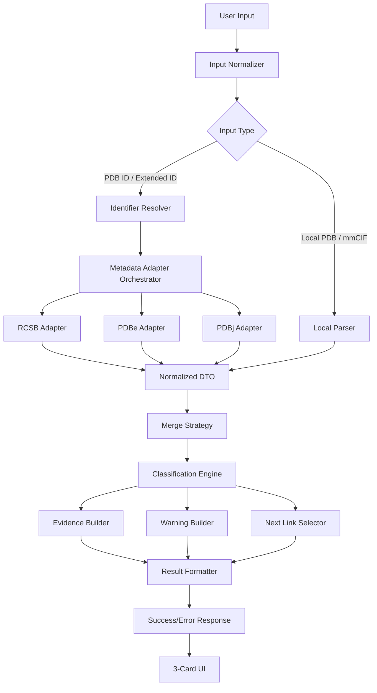

# 詳細設計書

## この文書の位置づけ

この文書は、BioFile Guide for Structure の全体アーキテクチャ、責務分割、DTO、応答スキーマ、外部アクセス、キャッシュ・リトライ・mock、セキュリティ、schema version の詳細正本である。
親正本は [`../設計書.md`](../設計書.md) であり、この文書は親正本が定める不変条件と参照ルールに従う。

この文書は、判定表、reason / evidence code、unknown UI 文言、next_links、匿名計測、ゴールドセット、実装順序の詳細正本ではない。
それらは該当する子文書を参照する。

---

## 詳細設計の責務範囲

本書は、入力から応答までの構造を実装単位へ落とすための文書である。
入力判定、構文判定、メタデータ抽出、判定エンジン、reason / evidence 生成、表示整形、next_links 選定、匿名計測、ゴールドセット検証は、それぞれ独立責務として扱う。

| 実装責務 | 主な責務 | 詳細正本 |
| --- | --- | --- |
| Input Normalizer | 空入力、ID候補、ローカルファイル候補の入口整理 | [判定表詳細](decision-table.md) |
| Identifier Resolver | 4文字PDB ID / 拡張PDB ID の正規化、存在確認状態の取得 | [判定表詳細](decision-table.md) |
| Local Parser | ローカルPDB / mmCIF の構文成立確認とメタデータ抽出 | 本書、[判定表詳細](decision-table.md) |
| Metadata Adapter | RCSB / PDBe / PDBj の API 差分吸収 | 本書 |
| Merge Strategy | 複数ソースの優先順位と競合処理 | [判定表詳細](decision-table.md) |
| Classification Engine | `record_type`、`source_database`、`legacy_pdb_compatibility` などの主判定 | [判定表詳細](decision-table.md) |
| Evidence Builder | reason / evidence / warning code の生成 | [reason / evidence code 定義書](reason-evidence-codes.md) |
| Warning Builder | `warning_codes` から `beginner_warning` を生成 | [unknown UI 文言仕様](unknown-ui.md) |
| Next Link Selector | allowlist テンプレートから次の一手を返す | [next_links 選定仕様](next-links.md) |
| Result Formatter | success / error envelope へ整形し、3カードUIへ渡す | 本書、[unknown UI 文言仕様](unknown-ui.md) |
| Anonymous Telemetry | イベントコードと非可逆的カテゴリのみを扱う | [匿名計測仕様](anonymous-telemetry.md) |
| Gold Set Validation | 判定表、unknown、next_links、UI表示の受け入れ確認 | [ゴールドセット定義書](gold-set.md) |

---

## 3カードUIとの接続

Result Formatter は、契約済みの success / error 応答を UI に渡す。
結果画面は3カード固定であり、カードの詳細表示契約は [unknown UI 文言仕様](unknown-ui.md) を正本とする。

* カード1は `record_type`, `resolved_format`, `source_database`, `experiment_method`, `confidence` を表示する。
* カード2は `beginner_warning`, `legacy_pdb_compatibility`, `legacy_pdb_reason_text`, `model_count`, `chain_count`, `ligand_status`, `water_status` を表示する。
* カード3は `recommended_next_step`, `next_links` を表示する。

---

## success / error / unknown / confidence の流れ

* envelope は `success` または `error` のどちらかで返す。
* 分類不能は通常 `success + unknown` として扱う。詳細分岐は [判定表詳細](decision-table.md) を参照する。
* `unknown` の見せ方と `confidence` の表示契約は [unknown UI 文言仕様](unknown-ui.md) を参照する。
* reason / evidence の必須条件は [reason / evidence code 定義書](reason-evidence-codes.md) を参照する。
* `next_links` と `recommended_next_step_code` は [next_links 選定仕様](next-links.md) を参照する。

---

## 1. 外部環境と戦略的位置づけ

RCSB は公式に Data API を公開しており、REST と GraphQL の両方を提供している。PDBe は公開 REST API を持ち、その entry pages 自体がこの API を利用し、週次更新と週次テストを案内している。PDBj も REST interface を一般公開している。つまり、**公式側は探索・参照・メタデータ取得のための programmatic access をすでに持っている**。 ([data.rcsb.org][1])

wwPDB は PDBx/mmCIF を公式の標準アーカイブ形式と位置づけており、拡張PDB ID の導入後に発行されるエントリは legacy PDB format と互換ではないと案内している。拡張PDB ID は mmCIF 側に保持される。したがって、**入口で「何者か」「どのフォーマット前提か」「旧PDB互換に注意が要るか」を翻訳する価値は実在する**。 ([wwpdb.org][2])

Mol* は web-based open-source toolkit として公開され、Viewer には `Open Files` や `Download Structure` がある。したがって、**構造読込と表示は Mol* を活用できる**。一方で、本プロダクトの差別化は「表示すること」そのものではなく、**公式基盤を使いに行く前の入口判断を短く翻訳すること**にある。 ([molstar.org][3])

---

## 4. 実行境界と外部アクセス契約

### 4-1. ローカルファイル処理

ローカルPDB / ローカルmmCIF は、原則として**ブラウザ内でのみ処理**する。
ローカルファイル本文、座標、ファイル名、生テキストは外部送信しない。

### 4-2. ID入力時の外部アクセス

`pdb_id` および `extended_pdb_id` 入力時は、対応する外部メタデータ取得のために API アクセスを行う。

外部送信してよいのは以下に限定する。

* 正規化済み識別子
* API問い合わせに必要な最小限のパラメータ

送信してはならないものは以下とする。

* ローカルファイル本文
* 座標情報
* 原ファイル名
* ローカルで抽出した可逆的構造内容
* 個別分子情報を復元可能な派生データ

### 4-4. allowlist

外部遷移先と API 接続先は allowlist で固定管理する。
任意URLの動的組み立ては禁止する。

---

匿名計測との境界は [匿名計測仕様](anonymous-telemetry.md) を正本とする。

---

## 5. データソース戦略

### 5-1. ソースの役割固定

本プロダクトでは、複数公式ソースを**同格に扱わない**。
役割は以下で固定する。

| 役割        | ソース  | 用途                         |
| --------- | ---- | -------------------------- |
| Primary   | RCSB | ID解決、標準メタデータ、主判定の主根拠       |
| Secondary | PDBe | 補助照合、欠損補完、フォールバック          |
| Tertiary  | PDBj | 補助照合、日本語導線、検索補助、ローカル閲覧導線補助 |

### 5-2. 基本方針

* まず Primary を使う
* Primary が失敗したら Secondary を使う
* Tertiary は主に補助・照合・日本語導線に使う
* 複数ソースを成功させても、merge strategy なしに混ぜない
* classification engine には、**正規化済みDTOだけ**を渡す

---

## 7. Mol* の責務固定

Mol* は、**構造読込・表示・ローカル閲覧導線**の基盤として利用してよい。Mol* Viewer には `Open Files` と `Download Structure` があるため、この役割は外部環境とも整合する。 ([molstar.org][4])

ただし、Mol* を以下の判断基盤として使ってはならない。

* `record_type`
* `source_database`
* provenance 判定
* `legacy_pdb_compatibility`
* unknown / error の出し分け
* 複数ソース競合時の merge strategy

これらは、**公式APIを adapter 経由で取得し、正規化DTOへ落としたメタデータ**に基づいて判定する。Mol* 側の provider や読込成功は、判定契約の一次根拠に使わない。 ([data.rcsb.org][1])

---

## 8. `resolved_identifier` と存在確認の契約

### 8-1. 基本原則

`resolved_identifier` は、**URL組み立てとAPI問い合わせに使う正規化済み canonical identifier** である。
`resolved_identifier` が非nullであることは、**実在確認済みであることを意味しない**。

### 8-2. 追加フィールド

成功応答に以下を持つ。

* `entry_resolution_status: verified | not_found | unresolved`

意味は以下。

* `verified`: 公式APIで対象エントリの存在を確認できた
* `not_found`: 形式は妥当だが、存在確認で該当エントリを確認できなかった
* `unresolved`: ローカル入力、API不達、または存在確認不能

### 8-3. UI 契約

* `entry_resolution_status=verified` のときのみ、実在確認済みとして扱ってよい
* `entry_resolution_status=not_found` のとき、UI は「形式は正しいが、該当エントリは確認できなかった」と表示する
* `entry_resolution_status=unresolved` のとき、存在可否を断定してはならない

---

## 11. 応答エンベロープ

すべての応答は以下のいずれかとする。

```json
{
  "schema_version": "1.0.0",
  "status": "success",
  "result": {}
}
```

```json
{
  "schema_version": "1.0.0",
  "status": "error",
  "error": {}
}
```

---

## 12. 成功応答スキーマ

```json
{
  "schema_version": "1.0.0",
  "status": "success",
  "result": {
    "input_type": "pdb_id | extended_pdb_id | local_pdb | local_mmcif",
    "resolved_identifier": "string | null",
    "entry_resolution_status": "verified | not_found | unresolved",
    "resolved_format": "pdb | mmcif | unknown",
    "record_type": "experimental_structure | computed_model | integrative_structure | unknown",
    "source_database": "PDB | AlphaFoldDB | ModelArchive | local_file | unknown",
    "experiment_method": "string | null",
    "model_count": "number | null",
    "chain_count": "number | null",
    "ligand_status": "detected | not_detected | unknown",
    "water_status": "detected | not_detected | unknown",
    "legacy_pdb_compatibility": "compatible | caution | incompatible | unknown",
    "legacy_pdb_reason_code": "string | null",
    "legacy_pdb_reason_text": "string | null",
    "confidence": {
      "scope": "primary_classification",
      "level": "high | medium | low"
    },
    "warning_codes": ["string"],
    "beginner_warning": ["string"],
    "unknown_reason_code": "string | null",
    "evidence": [
      {
        "code": "string",
        "detail": "string"
      }
    ],
    "recommended_next_step_code": "string",
    "recommended_next_step": "string",
    "next_links": [
      {
        "label": "string",
        "reason": "string",
        "destination_type": "canonical_entry | viewer_remote | viewer_local_guide | guide_article | search_entry | internal_guide",
        "href": "string"
      }
    ]
  }
}
```

---

## 13. 失敗応答スキーマ

```json
{
  "schema_version": "1.0.0",
  "status": "error",
  "error": {
    "error_code": "parse_failed | unsupported_input | empty_input | invalid_identifier | entry_not_found | unknown_classification | file_too_large | timeout_exceeded | external_metadata_unavailable",
    "message": "string",
    "reason": "string",
    "confirmed_facts": [
      {
        "code": "string",
        "detail": "string"
      }
    ],
    "recommended_next_step_code": "string",
    "recommended_next_step": "string",
    "next_links": [
      {
        "label": "string",
        "reason": "string",
        "destination_type": "viewer_local_guide | guide_article | search_entry | internal_guide | canonical_entry",
        "href": "string"
      }
    ]
  }
}
```

---

## 25. アーキテクチャ方針

### 25-1. 高水準構成



### 25-2. 最重要原則

* adapter は外部API仕様差分を吸収する
* merge strategy は adapter の外で固定する
* classification engine は生レスポンスに触れない
* warning builder はコード主導で動く
* next link selector は allowlist テンプレート以外を使わない
* viewer は Mol* を使ってよいが、判定責務を負わせない

---

## 26. 正規化DTO契約

### 26-1. DTOの目的

DTOは、複数ソースの API レスポンス差分を吸収し、分類エンジンへ渡すための内部契約である。

### 26-2. 最低限の型契約表

| フィールド                        | 必須/任意 | nullable | 説明                                  |
| ---------------------------- | ----- | -------- | ----------------------------------- |
| `input_type`                 | 必須    | いいえ      | 元入力種別                               |
| `resolved_identifier`        | 任意    | はい       | 正規化済み識別子                            |
| `entry_resolution_status`    | 任意    | はい       | verified / not_found / unresolved   |
| `resolved_format_hint`       | 任意    | はい       | `pdb/mmcif` のヒント                    |
| `archive_exists`             | 任意    | はい       | エントリ存在確認                            |
| `experiment_method`          | 任意    | はい       | 実験法                                 |
| `record_type_markers`        | 任意    | いいえ      | ModelCIF/IHM等の直接根拠群                 |
| `provenance_markers`         | 任意    | いいえ      | PDB/AlphaFoldDB/ModelArchive根拠群     |
| `model_count`                | 任意    | はい       | モデル数                                |
| `chain_count`                | 任意    | はい       | 鎖数                                  |
| `ligand_detected`            | 任意    | はい       | ligand 検出ヒント                        |
| `water_detected`             | 任意    | はい       | water 検出ヒント                         |
| `legacy_compatibility_hints` | 任意    | いいえ      | 旧PDB互換性ヒント                          |
| `source_used`                | 必須    | いいえ      | primary/secondary/tertiary のどれを使ったか |
| `source_conflicts`           | 任意    | いいえ      | 競合検知結果                              |

---

## 27. キャッシュ・リトライ・mock 方針

### 27-1. キャッシュ

* 同一セッション内キャッシュを持つ
* キャッシュキーは `adapter + schema_version + resolved_identifier`
* TTL は 15分
* cross-session 永続保存は行わない
* ローカルファイル本文はキャッシュしない

### 27-2. タイムアウト

* RCSB adapter: 3.5秒
* PDBe adapter: 3.5秒
* PDBj adapter: 4.0秒
* ローカル解析: 5秒

### 27-3. リトライ

* 同一 adapter への再試行は 1回まで
* 再試行対象は network error / timeout / 5xx
* 4xx は再試行しない
* Primary が network/timeout/5xx で失敗したときのみ Secondary へフォールバックする
* Tertiary は主に補助用途であり、Primary/Secondary の代替主系にはしない

Secondary / Tertiary 失敗痕跡の evidence 生成ルールは [reason / evidence code 定義書](reason-evidence-codes.md) を正本とする。

### 27-5. mock / CI

* CI では外部API直叩きを禁止する
* adapter mock または recorded fixture を使う
* merge strategy / classification engine / warning builder / next link selector は mock 前提で再現可能でなければならない
* 本番APIへの疎通確認は CI 本線ではなく、別の任意確認ジョブで行う

---

## 28. セキュリティと運用制約

* allowlist 外 URL を返してはならない
* 動的HTML挿入を禁止する
* 文字列表示前にサニタイズする
* query parameter 経由の任意URL遷移を禁止する
* ローカルファイル本文をログ出力してはならない
* 開発ログは production build で抑制可能にする

---

## 31. schema version 互換性方針

* **patch**: バグ修正、文言修正。既存フィールド意味を壊さない
* **minor**: 後方互換を保ったフィールド追加
* **major**: 既存フィールド意味、列挙値契約、必須性を壊す変更

`1.0.0` の時点では、既存フィールド名と意味を独断で変更してはならない。

---


[1]: https://data.rcsb.org/?utm_source=chatgpt.com "data-api – RCSB PDB Data API: Understanding and Using"
[2]: https://www.wwpdb.org/documentation/file-formats-and-the-pdb?utm_source=chatgpt.com "wwPDB: File Formats and the PDB"
[3]: https://molstar.org/?utm_source=chatgpt.com "Mol*"
[4]: https://molstar.org/viewer/?utm_source=chatgpt.com "Mol* Viewer"

